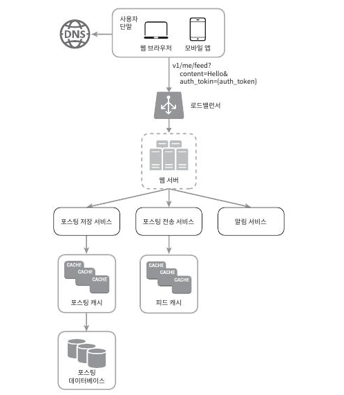
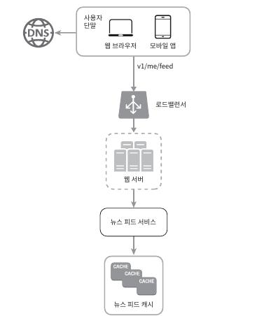

# 11-News-Feed-System-Design

## 뉴스 피드(News Feed)란?

### 뉴스 피드는 홈 페이지 중앙에 지속적으로 업데이트 되는 스토리들로, 사용자 상태 정보 업데이트, 사진 ,비디오, 링크, 앱 활동, 팔로워하는 사람들, 페이지, 또는 그룹으로부터 나오는 '좋아요' 등을 포함한다.

---

## 설계안 
- 피드 발행 : 사용자가 스토리를 포스팅하면 해당 데이터를 캐시와 데이터베이스에 기록한다. 새 포스팅은 친구의 뉴스 피드에도 전송된다.

- 뉴스 피드 생성 : 지면 관계상 뉴스 피드는 모든 친구의 포스팅을 시간흐름 역순으로 모아서 만든다고 가정한다.

### 뉴스 피드 API
 뉴스 피드 API는 클라이언트가 서버와 통신하기 위해 사용하는 수단이다. HTTP 프로토콩 기반이고, 상태 정보를 업데이트하거나, 뉴스 피드를 가져오거나, 친구를 추가하는 등의 다양한 작업을 수행하는 데 사용한다.

  - 피드 발행 API
    - 새 스토리를 포스팅 하기 위한 API이다. HTTP POST 형태로 요청을 보내면 된다. POST/v1/me/feed
    - 인자 :
        - 바디(body) : 포스팅 내용에 해당
        - Authorization 헤더 : API 호풀을 인증하기 위해 사용한다.

 - 피드 읽기 API
    - 뉴스 피드를 가져오는 API다. GET/v1/me/feed
    - 인자 : 
        - Authorization 헤더 : API 호출을 인증하기 위해 사용한다.

## 피드 발행 

 

 - 사용자 : 모바일 앱이나 브라우저에서 새 포스팅을 올리는 주체다. POST/v1/me/feed API를 사용한다.
 - 로드밸런서 : 트래픽을 웹 서버들로 분산한다.
 - 웹 서버 : HTTP 요청을 내부 서비스로 중계하는 역할을 담당한다.
 - 포스팅 저장 서비스(post service) : 새 포스팅을 데이터베이솨 캐시에 저장한다.
 - 포스팅 전송 서비스(fanout service) : 새 포스팅을 친구의 뉴스 피드에 푸시한다. 뉴스 피드 데이터는 캐시에 보관하여 빠르게 읽어 갈 수 있도록 한다.
  - 알림 서비스(notification service): 친구들에게 새 포스팅이 올라왔음을 알리거나, 푸시 알림을 보내는 역할을 담당한다.

## 뉴스 피드 생성

 

 - 사용자 : 뉴스 피드를 읽는 주체다. GET/v1/me/feed API를 이용한다.
 - 로드밸런서 : 트래픽을 웹 서버들로 분산한다.
 - 웹 서버 : 트래픽을 뉴스 피드 서비스로 분산한다.
 - 뉴스 피드 서비스(news feed service) : 캐시에서 뉴스 피드를 가져오는 서비스다.
 - 뉴스 피드 캐시(news feed cache) : 뉴스 피드를 렌더링할 때 필요한 피드 id를 보관한다.

 ## 상세 설계안

  

---
---

## DB 기본 설계

**user** 테이블
------
user_no       | int (PK)  | 사용자 고유 번호  
user_id       | varchar   | 로그인 ID  
user_name     | varchar   | 사용자 이름  
created_at    | datetime  | 계정 생성 날짜 (optional)  

**feed** 테이블
------
feed_no       | int (PK)  | 피드 고유 번호  
user_no       | int (FK)  | 작성자 번호  
feed_content  | text      | 피드 내용  
time          | datetime  | 작성 시간  

**follow** 테이블
------
follower_no | int (FK)  | 팔로우를 건 사용자 번호  
followee_no | int (FK)  | 팔로우 당한 사용자 번호  
enable | int | (언팔 : 0, 팔로우 1)  
created_at  | datetime  | 팔로우한 날짜  